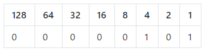

Binary or base 2 is a number system which only uses the digits `0` and `1`. We usually use denary, which uses the digits `0` to `9`.

Here is the number `5` in binary:

The top line of numbers represent the **place value** of each digit, rather like you may have written `H T U` to represent hundreds, tens, and units when you were very young. Notice that these place values double as they move to the left.

If we are given a binary number like `00000101`, we can work out the equivalent number in denary by adding the place values containing a `1` together. In this case, we have `4 + 1 = 5`.

Each place is called a **bit**, so in this example we're representing the number `5` with eight bits.

The largest positive integer we can represent using eight-bit notation is `255` — in binary it is `11111111`. To represent larger numbers, we need more bits!
